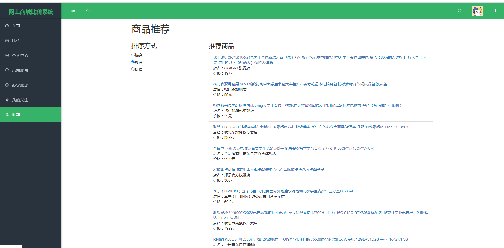

## 计算机毕业设计Python+Django商品比价系统 电商比价系统 商品推荐系统 商品可视化 商品爬虫 机器学习 深度学习 京东爬虫 国美爬虫 淘宝爬虫 大数据毕业设计 电商推荐系统 商品价格预测 K-means聚类推荐算法 深度学习Kears 小说数据分析可视化 机器学习 Scrapy爬虫 协同过滤推荐算法 混合神经网络推荐算法 PySpark Hadoop Hive Hadoop PySpark 机器学习 深度学习 Python Scrapy分布式爬虫 机器学习 大数据毕业设计 数据仓库 大数据毕业设计 文本分类 LSTM情感分析 大数据毕业设计 知识图谱 大数据毕业设计 预测系统 实时计算 离线计算 数据仓库 人工智能 神经网络

## 要求
### 源码有偿！一套(论文 PPT 源码+sql脚本+教程)

### 
### 加好友前帮忙start一下，并备注github有偿纯python比价系统
### 我的QQ号是2827724252或者798059319或者 1679232425或者微信:bysj2023nb 或bysj1688

# 

### 加qq好友说明（被部分 网友整得心力交瘁）：
    1.加好友务必按照格式备注
    2.避免浪费各自的时间！
    3.当“客服”不容易，repo 主是体面人，不爆粗，性格好，文明人。
	
	
网上商城比价系统有2个版本
新版:
1、增加了苏宁易购平台的爬虫，双平台比价
2、登录界面加了一个填写验证码的操作
3、比价模块：给加了一个搜索框，可以根据输入的关键词来比价；多加了3张可视化图表
4、个人中心模块：界面换掉，增加了一个上传头像的功能
5、爬虫模块：京东平台和苏宁易购平台都加了搜索框，可以根据输入的关键词来爬数据
6、推荐模块：加了推荐的方式（按热度、好评、价格）分别推荐，6种推荐算法：协同过滤推荐算法、卷积神经网络、SVM、混合神经网络、SVD、tensorflow	

演示视频
https://www.bilibili.com/video/BV1Cs421T7ui/?spm_id_from=333.999.0.0

学生姓名		学号		班级	
指导教师		职称		单位	
课题性质	设计 论文	课题来源	科研 教学 生产 其它
题目	基于Python爬虫的网上商城比价系统

一、课题研究的目的和意义
目的：
数据获取和分析：爬虫可以抓取各个网上商城的商品信息，包括价格、描述、图片等，然后对这些信息进行分析。这种方法可以快速获取大量数据，节省人工收集信息的时间和精力。
价格比较：通过爬虫获取到的数据，可以构建一个比价系统。这个系统能在用户输入商品名称后，自动抓取所有商城中该商品的价格，然后进行分析和比较，帮助用户找到价格最优的商品。
市场研究：通过对网上商城的数据进行统计和分析，可以得到一段时间内某类商品的销售情况，从而了解市场的需求和趋势，为生产商和销售商提供决策依据。
商品推荐：基于对用户购买行为的跟踪和分析，可以为用户推荐他们可能感兴趣的商品。
意义：
提高购物的便利性：比价系统可以帮助消费者快速找到价格最优的商品，节省了他们比较各家价格的时间。
促进市场竞争：当消费者能够轻易地比较各家价格时，可能会促使销售商降低价格以吸引消费者，从而加剧市场竞争。
市场研究和预测：通过分析网上商城的数据，可以得到市场需求的动态变化，这有助于生产商和销售商进行市场研究和预测。
反欺诈和反垄断：如果发现某些商品的价格异常低，可能是存在欺诈行为或者垄断行为，这时监管部门就可以及时介入调查。
了解消费者行为：通过分析消费者的购买行为，可以了解消费者的喜好和购买习惯，从而为消费者提供更好的服务。

二、国内外研究现状
在国内外，基于Python爬虫的网上商城比价系统都得到了广泛的研究和应用。
国外的研究现状：
国外学者针对Python爬虫技术开展了大量的研究，将Python爬虫技术与机器学习、自然语言处理等技术相结合，从而构建出一系列更加智能化的爬虫系统。
国外学者还研究了Python爬虫技术在搜索引擎优化、社交媒体分析、人工智能等领域的应用，为实际应用做出了重要贡献。
在比价系统方面，国外学者通过爬取网上商城的商品信息，建立商品数据库，利用数据分析和挖掘技术，为用户提供商品推荐和价格比较服务。
国内的研究现状：
国内学者在Python爬虫技术方面也进行了大量研究，主要集中在数据采集、信息抽取、文本处理等方面。
在比价系统方面，国内学者通过对网上商城的数据进行抓取和分析，为用户提供商品价格比较服务，同时还可以根据用户的购买行为进行个性化推荐。
在实际应用方面，国内电商网站如京东、淘宝等已经实现了比价系统功能，用户可以通过输入商品名称或关键词，获取不同商家的价格信息并进行比较。
综上所述，基于Python爬虫的网上商城比价系统在国内外都得到了广泛的研究和应用，同时也取得了很大的进展。未来随着技术的不断发展，比价系统将会更加智能化、个性化、精准化，为消费者提供更加优质的服务。

三、课题研究的内容
本系统是基于Python爬虫的网上商城比价系统的设计与实现，本系统操作系统为Windows系统、后端技术为Python的网络爬虫技术、ECharts可视化、商品推荐、Django框架，前端技术为html+css+layui框架，数据库为sqlite，数据库工具采用Navicat、开发工具为Pycharm。
    本系统的功能模块主要有：用户注册登录、商品展示与管理、商品比价可视化、用户信息修改、商品信息爬取、商品信息管理、我的关注、商品推荐模块：按热度、好评、价格分别推荐等。

四、毕业设计进度安排
第一阶段(2023年11月1日至2023年11月10日)收集资料；
第二阶段(2023年11月11日至2024年1月31日)系统设计与开发；
第三阶段(2024年2月1日至2024年2月29日)毕业论文初稿撰写；
第三阶段(2024年3月1日至2024年3月10日) 中期检查；
第四阶段(2024年3月11日至2024年3月20日)毕业论文修改及完善；
第五阶段(2024年3月21日至2024年4月5日)毕业论文定稿，准备毕业答辩。

五、毕业设计的预期结果（成果）
基于Python爬虫的网上商城比价系统毕业设计的预期结果（成果）包括：
实现一个功能完善的比价系统：该系统能够自动爬取各大网上商城的商品信息，包括商品名称、价格、描述、图片等，并能够进行数据清洗和预处理。
构建商品数据库：通过爬虫技术获取到的商品信息将被存储在数据库中，方便后续的数据分析和挖掘。
实现价格比较功能：用户可以在比价系统中输入商品名称或关键词，系统将自动抓取所有商城中该商品的价格并进行比较，用户可以查看不同商家的价格信息并进行价格排序。
实现个性化推荐功能：根据用户的购买行为和浏览记录，系统可以为用户推荐他们可能感兴趣的商品，提高用户购物的便利性和满意度。
实现可视化界面：比价系统将具备可视化界面，方便用户操作和使用。用户可以通过界面查看商品信息、价格比较结果以及个性化推荐。
提升系统的性能和稳定性：通过优化算法和代码实现，提高比价系统的性能和稳定性，确保系统的运行速度和响应时间。
进行技术交流和分享：完成毕业设计后，学生需要参加毕业答辩并向老师和同学展示成果。这将有机会与大家分享和学习新的技术知识和实践经验。
通过实现以上预期结果（成果），基于Python爬虫的网上商城比价系统毕业设计将为消费者提供更加全面、便捷的购物服务，同时也可以帮助生产商和销售商更好地了解市场需求和趋势，制定更加合理的生产和营销策略。

